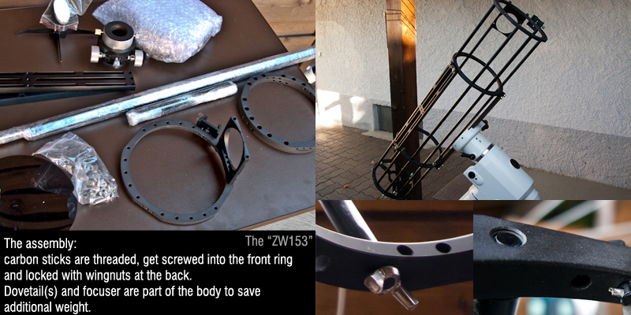
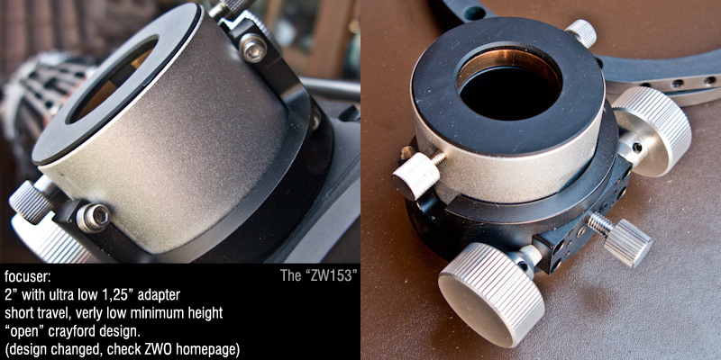
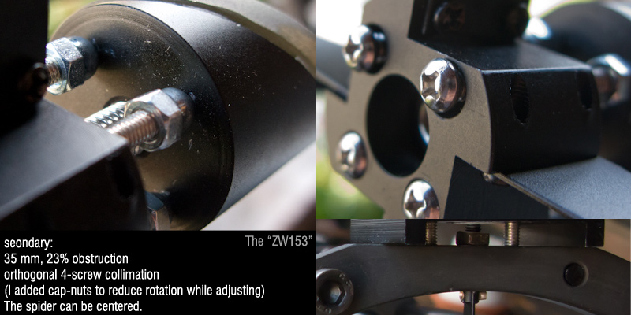
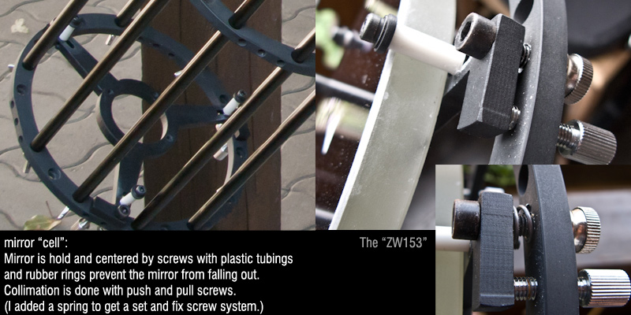
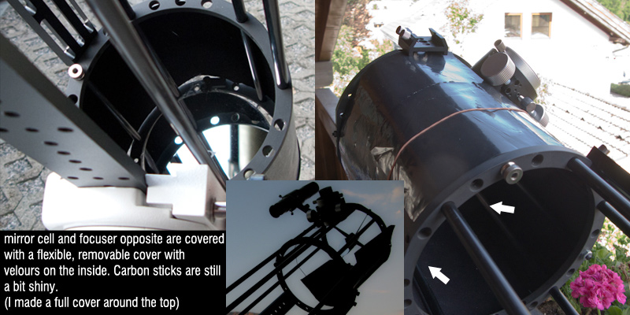
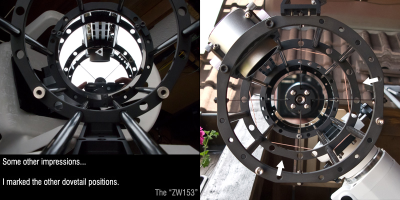

## The OTA

The whole package weights around 3kg including mirror and focuser. Disassembled it would nearly fit in your pocket. Main parts are 4 aluminum rings and a few carbon sticks of different length. Focuser and dovetail are part of the body. The carbon sticks are threaded on both ends, they are screwed in the top ring and fixed with wingnuts at the back.

There are different options for the dovetail(s). (see image 6) It depends on your mount type and prefered viewing position, which position makes sense for you.

> Observing with an equatorial mount is not newtonian friendly, also the ZW153 can't rotate in clamps, but focuser down in north position suits in most positions

I can't write much about the crayford focuser: it just works, can't see shift, all my equipment is hold as it should, but I don't have any heavy "Naglers" or "Ethos". My heaviest load was the cooled IMG-0H camera with 5x 1.25" filterwheel and barlow. (~600 grams)

For relaxed work in higher resolutions, I would recommend using a motor-focus. (see next chapter)

The low level focuser and the f/6 allows a 35mm secondary for less than 23% obstruction. Since I don't use 2" equipment oder large camera formats, I can't tell you the illumination performance on the edge.

The collimation of the secondary is done via an orthogonal 4-screw system and a center screw to fix it. I added caps on the screws to prevent the secondary from rotation, while collimation. (I did this on every newtonian I have) The spider can be centered by adjusting hex nuts on the outside.

The mirror cell is as simple as it can be. A small 6" mirror does not need any support-system. Though, I placed 3 small rubber patches on the triangle to get more fricton and less pressure on the holding screws. The holding screws sometimes got a bit loose during transport. I added some "crown-like" nut locks, this might scratch a bit in the aluminum, but keeps them in place even during rough transport.

The collimation was done by a simple push/pull screw system, with a additional spring you get a one-screw-set-system with a fixing-screw. I won't call this improvement, it's just what system you're familiar with.

To prevent contrast lowering from outside light, there are 2 covers included: one for the primary mirror and one opposite the focuser. They were made of a flexible plastic, pasted with velours inside. For the top I made a full cover, because I sometimes observe moon at day or twilight.

On my pictures the primary cover is outside the carbon sticks, ZWO has it inside on their pictures. Although the sticks are a bit shiny, I didn't noticed any bad contrast. I guess the small secondary and short focus helps here.

The mirrors are very good (as far as I can determine). Airy discs and defocussed star looks fine to me and the surface details I see, are most of the time limited by seeing. Contrast and brightness are good, so I guess the surface quality and coating is also good. 2 people and me compared it to a russian 6" 950mm mirror with pv 1/8 certification at high magnification at the moon, stars and global clusters and we saw no difference.

[comment]: # Drawbacks, Experiences and Summary on

***

## Drawbacks

Of course such a lightweight has its drawbacks. I want to make clear, that this are just the facts and nothing, that really bothers me.

I guess the behavior changes bit with other diameter and length and I saw a square carcass at the 10" and above models. Would be interesting, how they behave.

### Rigidity

I noticed little shift when loading the cooled CCD with filter wheel. (600 g) So fine collimation should be done with your setup at the star and not only via laser or sighttube, if you have heavy equipment. (Normally you should do this anyway, but I know lot of people missing that.)

If you plan guiding, I would go for a dual-mount and not stress the scope with additional weight. Also you should switch to a dovetail-position, where camera has the least leverage.

### Vibration

In high magnification you will notice vibration, when touching the scope or going faster speed-stops with the mount. In Deepsky observation with less than 60x magnification, you will hardly notice.
The vibration is high frequent and stops 1-2 seconds after touching.
If you want stressless focussing, you should go for a motorized focusser (The focuser has holes to fit one, I guess the popular FOC NC2 should do it.)

### Mobility

This scope is a bit black and white for me. It's perfect for vacation with light luggage or small space available, but I don't want to disassemble the whole scope every night or even assemble it just for a quick hour. I miss a way to collapse it by releasing just 2-5 screws. That's maybe a challenge for the future. :)

But: it fits perfectly as it is in my hiking backpack together with a small mount and tripod on the outside. (I missed to take a picture) and that's the mobility I like: Its weights nearly nothing. You just have to make shure, that no other equipment can fall on the primary. (I have some pieces of cardboard for that.

### Open design

Well, I guess every open dobson user will know, but I'll mention it:

- Dew on the primary is a bit more likely, than in closed tubes, but it has to be very wet air.
- You will have a bit more dust and pollen on your primary. (AND YOU WILL SEE IT BETTER :D ) I know some people, who would clean it daily. I never cleaned the mirror until now and it's fine (1 year), I will go for it after this summer.
- **NEVER** use this scope in sunlight or let it stay outside, when you have no control. The open primary has a wide entrance angle and will burn itself or everything around it. If you want to use a solar filter foil be sure to cover the whole assembly light- and windsafe.

## Experience

[comment]: # Add pictures and a bit exp.

I wish I could share here tons of pictures, but one aspect of this scope for me is visual observation at places, which I can't reach with photographic equipment. This scope was taken on some mountains in my region (alps, germany) above 1500 meters on a small "giro" mount (simple alt/az, [Link](http://www.tele-optic-tecnica.de/mounts.html) . I usually enjoy the typical brighter objects, nothing really special. Unfortunately I have no patience to write observation reports...

For planets I usually use my C9.25, when seeing is good. Sorry ZW153, here aperture counts. Although I made some planet pictures with the ZW153, I only share one NIR-saturn. Bad seeing saturns give me the creeps.

[comment]: # Saturn pic

But I have some better moons for you. I like doing big moon mosaics and the ZW153 is the perfect setup for that. You can watch raw videos from one of the mosaic's in one of my youtube videos: (Video: [The Moon in HD](http://www.escope.de/videos/interactive-moon-tour-on-youtube/)

## Summary

### Weight

To be honest, the 6" version of this design won't be the indicator for this design. The weight improvement against a full carbon tube is not significantly big (I looked at a carbon tube GSO mod from TS Germany, which is about 4 kg.). But if you scale this up to 10", the difference starts to matter.

### Mobilitys

[comment]: # sfor pic

Fully disassembled this is clearly a win. The longest parts are the thin carbon sticks in telescope length and the heaviest part ist the mirror. With a bit of packing material this fits everywhere and won't hurt your back, when carriing around. I think, there are not so much ultra-portable newtonians around, that would beat this.

### Visual use

You get everything you can expect for an excellent 6" Newtonian with low obstruction. Most of the todays popular telescopes are photo-optimized with big secondaries, heavy focusers and large backfocus. This scope is designed for visual use. If you often go for high magnification, use a motor-focus.

If you plan to use this scope on an EQ-mount, get at least 2 dovetails, so you can always choose the right position.

I won't tell you any possible magnification numbers, this depends so much on the observers impression.

### Photographic use

This scope is no deep-sky-photo-machine. Although it sure has perfect optics, the mechanics are not made for the heavy equipment, that is mostly used and necessary.
Solar system imaging is no problem. The cameras are light, have no backfocus problem, due to compact camera-designs and barlow use, but as I said, i'd recommend a motorized focuser.

### Buying from ZWOptical (China)

The contact to ZWO was just a pleasure. We shared pictures and experiences, also Wen from ZWO is a member of the cloudynights community and is fluent in english. The telescope was send to me via express mail in two small parcels. Check your local toll and tax laws, if you have to expect additional costs.

You can also ask your local distributor of ZWO [Link](http://www.zwoptical.com/Eng/Contact/index.asp).

## Links

- [ZWOptical](http://www.zwoptical.com/Eng/)
- [ZW153 Page](http://www.zwoptical.com/Eng/Optics/153/index.asp)
- [ZWO "Mirror Lab"](http://www.zwoptical.com/Eng/Optics/Lib/index.asp)
- [ZWO User Group](http://zwoug.org/)