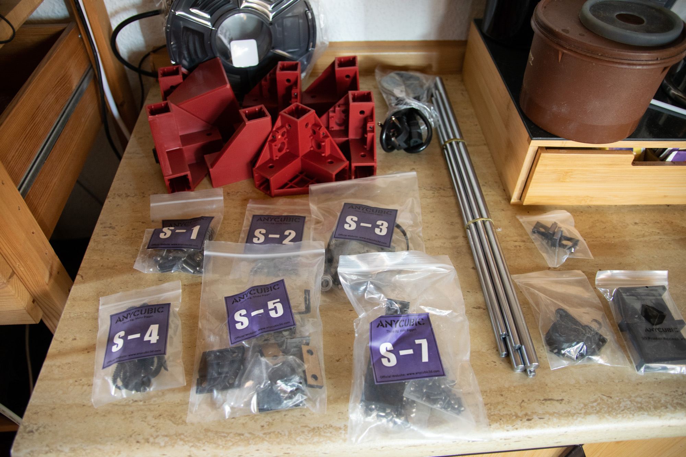
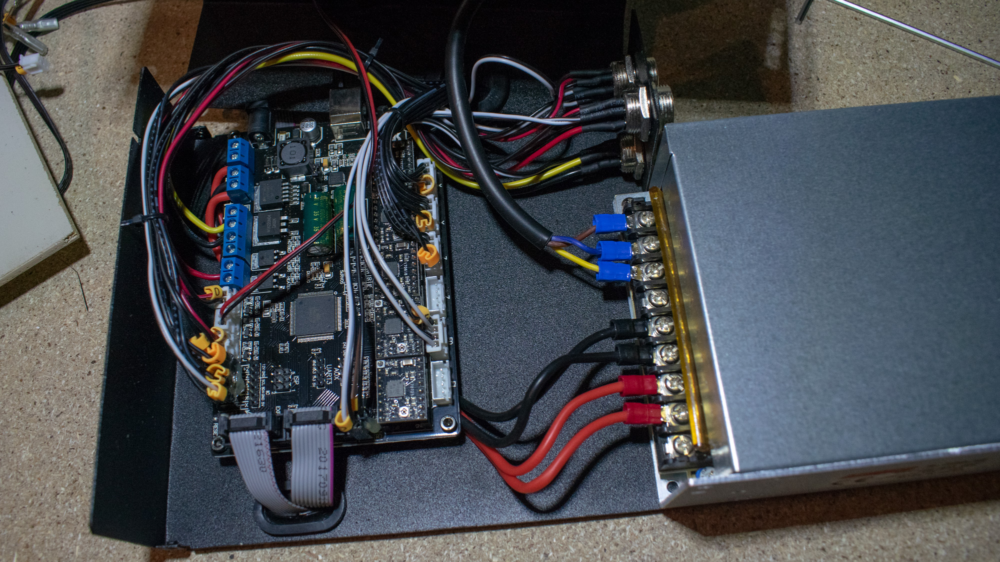
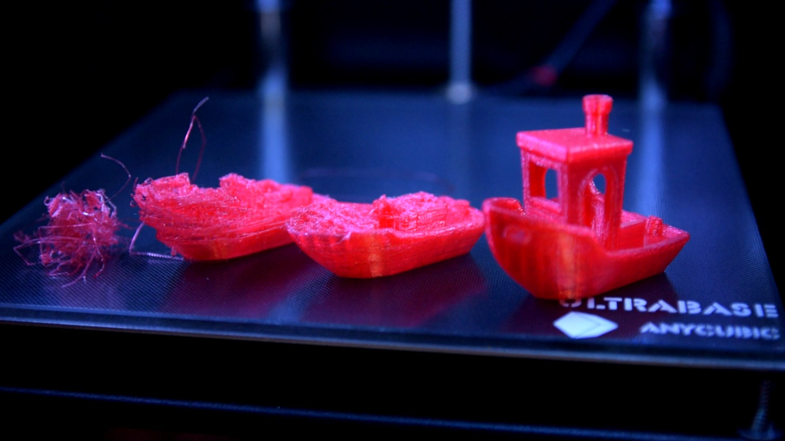
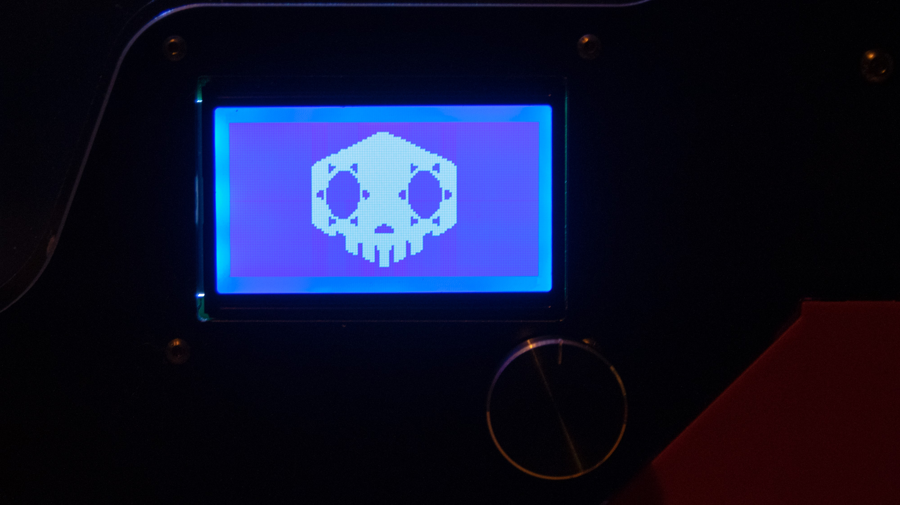

## The right 3D printer for me?

Choosing the right 3D printer to get started in the world of FDM printing is a bit like choosing your first digital camera. So the easiest choice would have been just to look up the most popular printers in the desired price range and get one with a decent curated community. But unfortunately I'm not that easy. Go for the latest, try to get the maximum for the money and take some risks.

That brought me to the Anycubic 4MAX. I ordered this printer from AliExpress mostly based on the questionable translated product translation and a few snippets of information I could find on the Internet only a few weeks after its release in spring 2018.

I had a few key points written together for my future 3D printer and the 4MAX matched most of them:

* direct extruder  
<small>pushing plastic under pressure over a long distance seemed quite unreasonable for me</small>  
4MAX &#8776; <small>only questionable MK8 Extruder/Hotend</small>

* heavy and sturdy assembly  
<small>having a solid base is key to almost every CNC machine to produce good results, so looking for a cubic frame is at least a good start</small>  
4MAX &#10004; <small>solid 20mm aluminum frame with supporting side panels</small>

* reasonable print bed solution  
<small>heated bed is a must, I also prefered a glass plate</small>  
4MAX &#10004; <small>well known anycubic ultrabase, heated</small>  
4MAX &#10008; <small>no auto bed leveling</small>

* open source firmware  
<small>with customizing and already upgrades in mind very important for me</small>  
4MAX &#10004; <small>RAMPS compatible Trigorilla board with known pinouts</small>  
4MAX &#10004; <small>well known LCD/SD Card board</small>  
4MAX &#10004; <small>running Marlin</small>

")

notable features of the 4MAX:

* dimensions: 400 x 425 x 500 mm
* print size: 210 x 210 x 300 mm
* construction: X/Y axis with hotend on top, Z axis with bed lowering
* suggested print speeds up to 60 mm/s
* single MK8 direct extruder up to 250° C (12 V)
* heated bed up to 110° C (12 V)
* simple filament runout sensor
* RAMPS 1.4 compatible anycubic Trigorilla board (USB possible)
* LCD/SD breakout board on the front
* Marlin firmware (v1.1.7)
* I paid 320 € via aliexpress

***

## The build

The printer arrived within two days directly from a german warehouse, so no hassle with customs, taxes and waiting for weeks. I already had ordered a few things via aliexpress, but this is a new level, wow. It all came in one huge 20 kg box, nicely packed and ordered and even with color printed instructions. There was also a german translated datasheet in the box, didn't expect that as well, wow again.

All parts were organized in well labeled zip-lock bags for each assembly step. The only thing I could criticize is the packaging of the panels: there was still some debris from cutting between the sheets, so I got a bunch of scratches on the panels. Nothing I really bother, but this could be addressed for future packaging.

The assembly was straight forward, it took me around 5 hours until I started my first test print. But since this is my first 3D printer I took my time and tried to understand the purpose of each part and to double check the alignment and calibration steps.

### The structure

The 20mm aluminum extrusions together with the red corner parts form a sturdy cube. The Y axis is directly mounted into the plastic corners with small ball bearings. The Z-axis rods and the motor are mounted to the extrusions. Since it's not a CoreXY system, the X-motor is mounted on the portal carriage. The whole X-assembly including the extruder and hotend came already preassembled and wired. The nozzle had some filament in it, so I guess it has been tested. Unfortunately there is, besides the provided spring clips, no easy way to tension the belts properly.

The only 3D printed parts in this kit were the X endstop/part cooling fan assembly and the filament runout sensor.

The side panels are cut out of some heavy metal/plastic sandwich material and add a lot of weight and sturdiness to the whole cube.

### Electronics

The Trigorilla board from Anycubic is based on the RAMPS design and aside from a few different pin outs fully compatible to the RAMPS 1.4 template in the marlin firmware (based on MEGA2560). The board comes with 5 replaceable Allegro A4988 drivers. The whole systems runs on 12 V, the power supply and the controller board are enclosed at the side of the cube, but accessible and cooled from the outside.

The combined LCD and SD card reader seemed to be a common design and also Marlin compatible without any problems. The downside is a weird SD card position on the inside and a single, wobbly rotary encoder. The position on the bottom of the cube gives a weird angle on the LCD.

Most cables are braided together to 3 strands, 2 from the X carriage and one from the heated bed. They are connected via round plugs to the controller case. The remaining endstops and motors are directly connected to the board via holes in the case top. Every cable is labeled even the connectors on the inside. Anycubic provided some zip-ties for the remaining cable management. I also printed some cable clips for the 2020 extrusions and used velcro ties to put everything in place.

### extruder, hotend and bed

The direct extruder is powered by a standard NEMA17 stepper. The filament gets pushed by a grooved, spring loaded bearing against the sharp gear. The pressure on the filament is strong and the gear leaves a decent mark before entering a PTFE tube in the heatbreak. There is a notable gap between the gear and the heatbreak, so you could run into problems with flexible material. (I have not tried so far)

Transfered heat gets cooled directly in the aluminum assembly of the extruder by a loud, high pressure fan.

The PTFE tube reaches all the way into the nozzle. The mechanical weak point of the whole assembly is the heatbreak, as extruder including the motor is only hold in place with the heatbreak and its counter screw, I guess a lot of vibrations can be minimized by fixing this.

> I disassembled it recently and never put back together. I don't know what caused this mess, but it smelled terrible. (after checking the upgrade options to get a full metal hotend I decided to instead invest in a complete new E3D v6 compatible kit).

The heated bed works like a charm. The heating time for 60° C is around 3 minutes, to get to 100° C it takes significantly longer. The temperature is hold stable without problems.

The anycubic ultrabase is a coated glass plate. It reminds me of some sort of sun shaded car window. At temperature the prints stick unbelievably well, after it cools down they release without great forces. I never had to use any tools or tape or glue or anything. But you have to wait until its cool to get your part.

To keep the surface working I wipe it off with alcohol before each print.

Their website ensures excellent flatness within 0.2mm range. Too bad that working with layer heights around 0.2mm this isn't excellent enough. My bed has around 0.15 mm difference in a dome shape in the middle to the edges.

> Today I use modified firmware with manual mesh bed leveling, so flatness in this range is no issue any more.

***

## the first prints

> After double checking endstop positons and axis alignments, I had to realize, that there was no way I could set the home position outside of the print bed. So you have to really make sure your Z endstop is in the right position and do the fine adjustments with the 4 spring loaded bed leveling screws.

Aside from that everything worked for me on the first go. I printed the provided owl pair without any problems, a decent Benchy and a few lens caps with the included black PLA with the default settings.  (210° C / 60° C / 0.2 mm / 45 mm/s)

## the first problems

* As already mentioned: the Z adjustment and leveling is a bit of a pain and leaves no room for errors. Otherwise you could easily crash your nozzle into the bed. Not really a problem as CNC machines always have the tendency to destroy themselves on user error, but you could minimize that with a little different design.

* My Ultrabase is not perfectly flat, it's a little dome in the middle. I'd guess its about 0.15 mm difference from the leveling screws to the middle. Not much, but already problematic on larger prints for a perfect first layer.

* The extruder started to struggle, when I switched to PETG. I got thinner layers over time, and eventually started to lose steps. Cranking up the temperature over 230° C helped, but not consistent enough. I also tried tuning the motor current, but that only extended the time until the extrusion would fail. Until this day I have no clue, what's the cause. With PLA everything is fine.

* This machine is loud. Especially the motors and the two controller board and power supply fans.

* The cube really needs a light. Even at bright daylight the inside is quite dark.

* Once the power from the Z motor is disabled, it has the tendancy to lower its position due to the weight. Don't know if this is a common issue or my grease reduced friction too much. (titan based bearing grease from my bike)  
<small>so I always have to make sure I home everything after a power loss, this also eliminates the whole resume after power loss idea.</small>

But dont worry: I've already addressed most of this issues either with firmware adjustments or some hardware fixes. I'll follow up this post with my solutions.

### print quality

This is my first printer so I don't have any experience to compare the results with other printers. The printer basicly does what I expected and need.

* dimensional accuracy out of the box
* proper g-code generates proper prints

The X/Y axis tend to vibrate on certain speeds and can lead to some afterswing effects on the surface. The extruder/hotend tend to blob and zit a bit on retraction, but I think most of it can be handled by adjusting the g-code settings.

Stringing, bed adhesion or Z wobble was never a problem. I had some extrusion and layer adhesion problems with PETG in the beginning, but I already got this fixed by adjusting the slicer.

>I'm just learning how to slice correctly and get a feeling for it. Most of the errors I experienced so far are on the g-code side and so my own fault.

***

## Summary

In the past few months my printer was very busy and I can't be happier with what I got for my money. Sure this printer has its weak points, especially with the MK8 extruder / hotend solution, but I think going for a direct extruder is the right choice for a printer with this design.

I also think this printer doesn't get to it's full potential with the provided firmware. Marlin has already built in manual (mesh) bed leveling routines, a more advanced extrusion control and firmware retraction. If you read this anycubic, put a few days into tweaking the firmware and this printer gets upgraded by 100%.

There is also an unused power FET on the board: 0.5 m LED strip, cable and some g-code for a 2020 LED strip mount and you suddenly get an awesome looking cube instead of a dark black box.

## Upgrade the 4MAX

As mentioned, I already upgraded my 4MAX with a few things, I'll cover them in future posts and will link them here.

* LED lights
* Stepper upgrade to Trinamic 2208 stepsticks (more silent and accurate)
* rewrite the whole Marlin config to enable LED control, mesh bed leveling and more
* completely redesign the X carriage mount for the hotend/extruder/cooling-fan/endstop and finally upgrading to a E3D Titan Aero
* minor upgrades like cable mounts, quiet fans
* Octoprint

Would I recommend it? Yeah...well..I..don't..know. I assume everyone, that goes for a 3D printer kit has at least some experience in electro mechanical design or wants to get used to it. The assembly isn't very demanding, but you have to get everything calibrated and well aligned, before you turn on a powerful stepper motor. I also would keep in mind, that you probably want to upgrade your hotend and extruder at some point. 

 As a student, I designed, built and worked with custom computer controlled optical microscopes.

## Links

- [Anycubic 4MAX product page](http://www.anycubic3d.com/products/show/1021.html)
- [Anycubic 4MAX support page](http://www.anycubic3d.com/support/show/594033.html)
- [Facebook Anycubic Group](https://www.facebook.com/groups/650270968508148/)