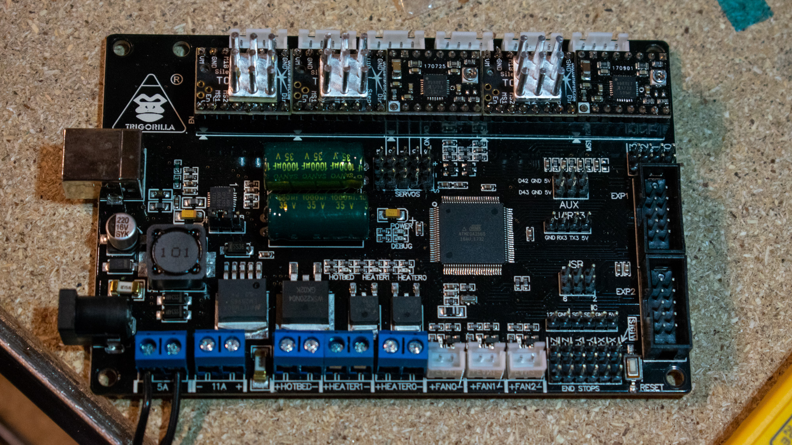

## It's a mess pt.1 - TMC2208 stepper drivers

It's been a while since I did my Titan Aero upgrade to my anycubic 4MAX and I promised to cover the changes in a new post/video.
Unfortunately I never really finished it, I just brought it to a working state for me and I always hesitated to release those changes to the public. It's kind of messy and not polished and I don't have a good feeling with it, but hey - why waiting - I guess everyone who tries to do these upgrade their own have at least a decent idea, what they are doing and I say it loud and clear:
**I GUARANTEE FOR NOTHING**

### TMC2208 driver upgrade

First step to a better 4MAX is upgrading the stepper drivers. The easiest solution are the TMC2208, as they are a fully compatible replacement and not only more accurate and reliant that the original drivers, but also much less noisy.

There are only 2 things to do:

#### set an appropriate Vref

<iframe src="https://www.youtube-nocookie.com/embed/5mLMEwRi0V8?rel=0&amp;showinfo=0" frameborder="0" allow="autoplay; encrypted-media" allowfullscreen></iframe>

With the Vref you limit the current that goes through the motor. I chose a value of about 0.5-0.6 A with led to a Vref of 0.7-0.85 V on my TMC2208s (see https://learn.watterott.com/silentstepstick/faq/ for the watterod stepsticks)
**!Important**: If you set the current too high, motors and drivers can overheat and lead to missing steps, shutdown or even permanent damage. I'd also recommend to get some small heatsinks for the drivers.

#### correct the direction

Unfortunately the TMC2208 reverses the steppers direction if you just replace them, so you have to either upgrade the firmware or forcefully push the connectors the wrong way into their sockets. The latter works just fine.(upgrading the firmware is covered later in the article).
**!Important**: Do not forget this. If you extrude the wrong way, it's not a big deal, if you smash your extruder or the bed into the limits, it may damage your machine (and it sounds horrible). Keep your finger on the power button, when first homing!

### useful links

* [Watterott shop - TMC2208 step sticks](https://www.watterott.com/en/SilentStepStick-TMC2208)
* [more information on the silent step sticks on watterott](https://learn.watterott.com/silentstepstick/)
* [TMC2208 trinamic product page](https://www.trinamic.com/products/integrated-circuits/details/tmc2208-la/)