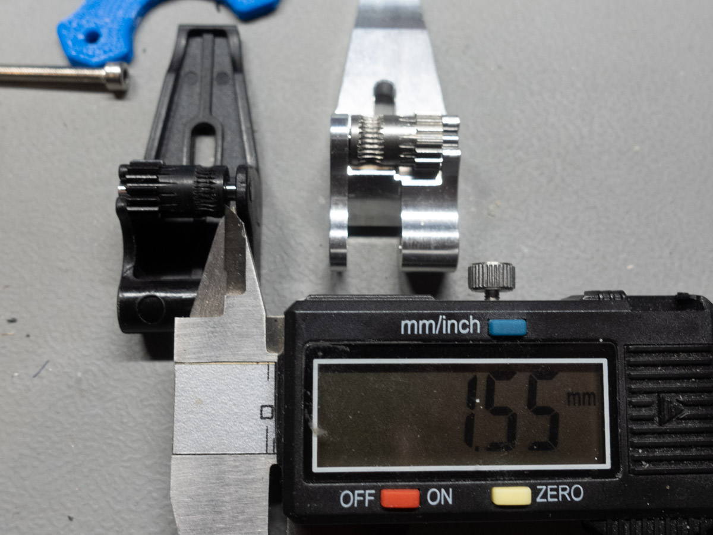

## That's not, how it's supposed to work

Already during the assembly of the Sapphire Pro I raised my eyebrow several times. And it came worse afterwards. The endstop microswitches just seemed to be either poorly placed or just the wrong type of endstop for their position. I completely reworked the hotend and later on, the cloned BMG tried to fool me.

<iframe src="https://www.youtube-nocookie.com/embed/_tloMJOFBV0?rel=0&amp;showinfo=0" frameborder="0" allow="autoplay; encrypted-media" allowfullscreen></iframe>

It was not really complicated to fix the issues and I just was cautious, because I had similar problems already in the past with other printers.

### The end stops

I actually never thought microswitch endstops could be an issue in a printer kit, but already my darkest secret from ANET proofed me wrong. So I was alarmed and double and triple checked how the endstop are supposed to work and the first "WHAT" was heard, when I checked the Y-axis.

It was mounted the other way round, the lever was pointing away from the linear carriage, that was supposed to hit the lever. Now the carriage just squeezed on the switch and the lever was just there to create additional resistance. Unscrewing the microswitch revealed the problem, it was not a assembly mistake, someone at TwoTrees bought the wrong microswitches with a too long lever. Great, so I grabbed some strong pliers and removed the excess lever part. **Y DONE**

The Z-axis switch acted a bit weird - the bend end from the lever was struggling on the edge of the Z-bearing. It slipped behind it right at the moment when it wanted to trigger. It may work fine, but there could just be one case in 50 times homing, when it triggers early and then we're 2 milimeters off. Grabbed my pliers - a little bit bending and we're fine **Z DONE**

The problem on the X-axis came apparent after I installed the belts for the coreXY motion system. unfortunately I decided to zip-tie the belts right next to the carriage instead of somewhere *in* the carriage. Now part of the excess belt gets pulled into the pully on the side when homing. But you guessed it, yes **BEND IT** and we gained two more millimeters and **X DONE**

### prevent the hotend disaster

Another MK8 hotend with PTFE tube inside the heater block. I can't tell yo much I hate this stuff so I always have all sorts of full metal heatbreaks lying around. I'm kidding - I actually planned to immediately switch out the complete hotend for a V6 system. "Luckily" my source sent me a MK8 heatbreak instead of a V6 one, well ok then. I also had a more "premium", coated nozzle for the MK8 left over from the Tevo Michelangelo. (this is just a flavored choice, lot of people are happy with and even prefer PTFE heatbreaks for low-temp materials like PLA)

What I actually wanted to say: the heatbreak was mounted without thermal compound and the nozzle was not tightened. I just add a little hint how a heater block including PTFE lined heatbreak looks like, when it's not perfectly sealed.

If you need help to understand, how this assembly should look like, check out this video: [Hot End Failure Modeling by Nerys](https://www.youtube.com/watch?v=uKN0VOuul0o)

### When the extruder works, but actually not

After my first test prints, I wanted to tweak the retraction and played around a bit with E-Jerk, acceleration and distance. But retraction did not really work, it almost seemed to get worse and randomly the flow of filament reduced and left me with layers and even whole sections of swiss cheese.

But how, I saw the motor working, the white drive gear turning, but the filament wasn't fed properly. I tried more tension the lever, but the gears seemed to grab properly. Just having my two other Titan extruders in mind, I wasn't aware, that the BMG gear is actually not shrink fitted on the drive shaft, but hold by a set screw and that was a bit lose and caused the gear to slip, when the torque was high enough. The more you now...

Now the extruder was already completely disassembled, I took a closer look at all the parts and chose not to assemble the extruder again. The filament path was not centered and the gear was not constrained on the lever, as a typical BMG would be.

After quick research in thingiverse, I started to print a new BMG housing on my Prusa in PETG. After a good hour of sanding, greasing and double checking each movable part, I assembled my extruder with all the cloned functional parts from the supplied extruder and all the problems are gone now. I'm not sure if the whole re-print was necessary, but now I'm sure everything is doing what it's supposed to do.

### Conclusion

You may have guessed: I'm better safe, than sorry. This is the sixth printer kit from china until now (3 of them for friends and co-workers) and if you not double and triple check each screw in the first place, you end up spending twice the time finding the errors. Some of the issues may also not apply to your exact printer kit. We've already learned, that the Sapphire Pro is actually an continously evolving product and gets frequently updated by TwoTrees. Hopefully to the better in the long term.

I don't want to tell you too much right now, it's not time yet for a qualified review, but I can already say, that this thing CAN print beautiful perimeters, my MK3s is already a little bit frightened.

happy printing,

alpine

## related links

* [TwoTrees 3d printers](https://www.twotrees3dprinter.com/)
* [Thingiverse BMG Extruder](https://www.thingiverse.com/thing:3235716)
* [(German) Megathread Drucktipps3D Forum](https://drucktipps3d.de/forum/topic/schon-gesehen-sapphire-s-pro/)
