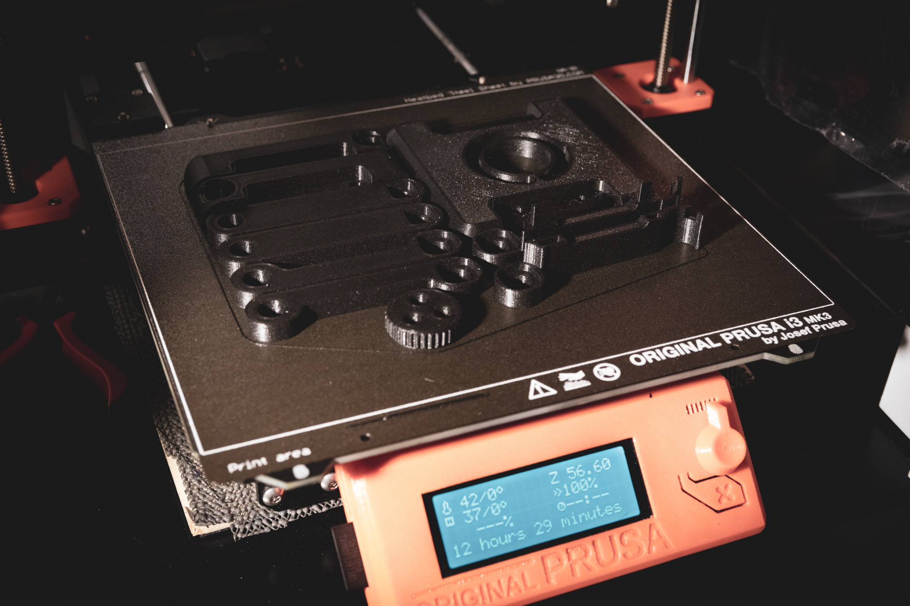
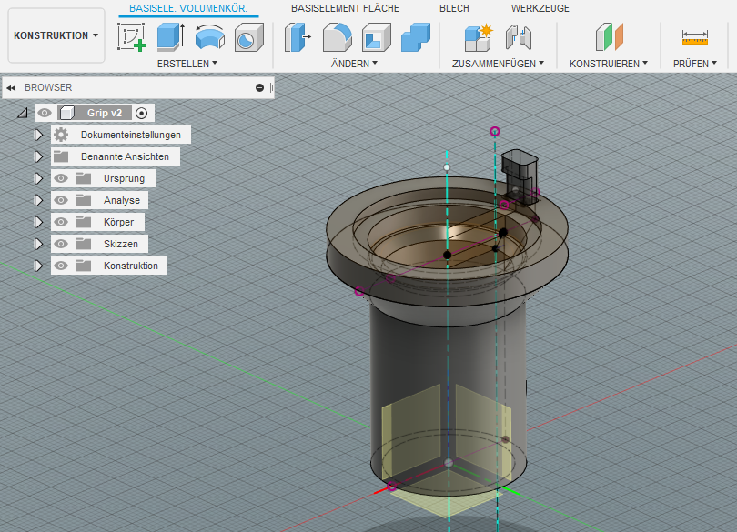
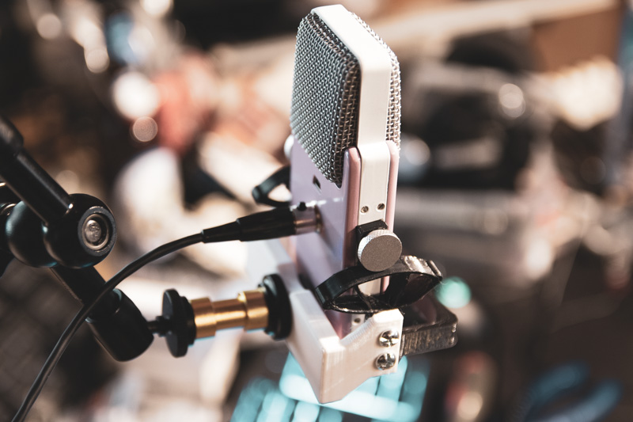

## 3D Druck Service

*Eigentlich* sind meine Drucker rein privat und dienen meinem Hobby. Aber ich bin natürlich gern bereit den ein oder anderen realisierbaren Druckauftrag anzunehmen oder sogar ein passendes Design zu erstellen, um ein wenig die Hobbykasse zu füllen. Wichtig ist mir hierbei der persönliche Kontakt und Zeit sollte nicht der entscheidende Faktor sein.

Denn nicht jedes 3D Modell ist uneingeschränkt herstellbar und auch die im Amateurbereich verwendeten Materialien sind nicht uneingeschränkt verwendbar. Auch ist FDM-Printing ein Verfahren zum herstellen von Prototypen und Einzelstücken und nicht gerade massentauglich.

Das Material PLA und PETG habe ich in einigen Farb- und Typvarianten immer zu Hause. ABS und das flexible TPU meist nur "das was da ist".

### Was kostet 3D Druck

Das Grundmaterial ist mit 15-40 Euro pro Kilogramm zwar nicht günstig, aber günstig genug, wenn man bedenkt, dass die Modelle meist im Grammbereich liegen. Der grosse Kostenfaktor ist die Anschaffung, der Unterhalt  und vor allem die Zeit.

Drucke, auch von kleineren Modellen benötigen i.d.R. einige Stunden, teils sogar Tage und ein Fehlschlag muss immer einkalkuliert werden.

Mein Startpreis liegt Grundsätzlich bei einem Kasten Bier.

### Wo?

Mein druckendes Wohnzimmer liegt in Pfronten im Allgäu. Bei Interesse schreibt mir einfach eine kurze E-Mail.

Viele Grüße

Korbinian
